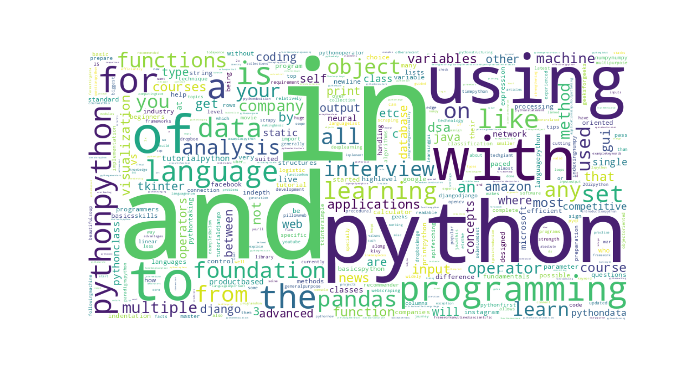
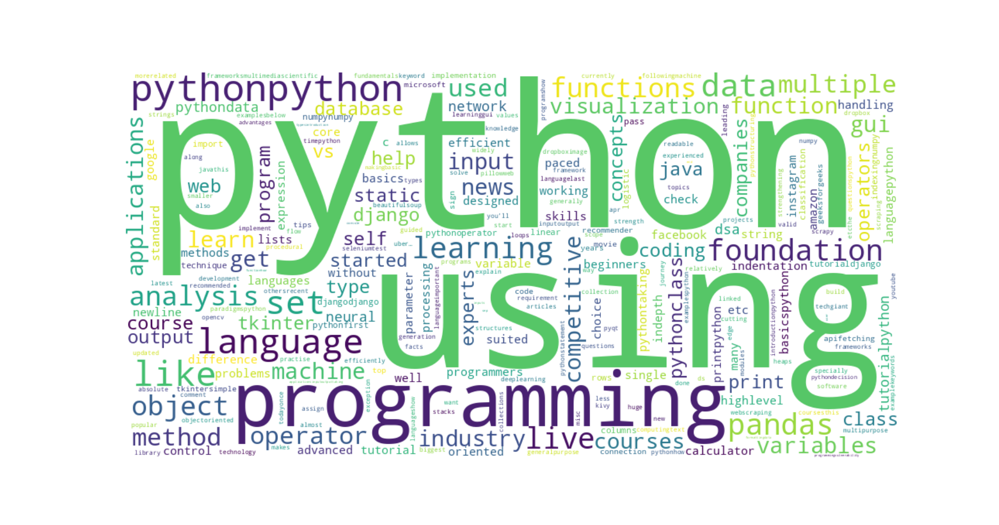

# web_crawler_top_words
Exercício do Segurança da Informação com Python do BootCamp Cognizant Cloud Data Engineer #2

No exercício foi feito um web crawler de um site e conta a quantidade de palavras usadas e mostra as mais usadas e ssua quantidades.
## Melhorias
- Remover Stop Words
    - Stop Words: uma palavra de parada é uma palavra comumente usada (como: "the", "a", "an", "in") que um mecanismo de pesquisa foi programado para ignorar, tanto ao indexar entradas para pesquisa quanto ao recuperá-las como resultado de uma consulta de pesquisa. 
    - Para removê-las vamos usar o NLTK (Natural Language Toolkit) que possui uma lista de palavras irrelevantes armazenadas em 16 idiomas diferentes.
- Usar wordcloud para fazer a visualização

## Configuração do ambiente

- [Poetry](docs/poetry.md) 
    - Usando o poetry para gerenciar as dependências do python 
    - obs: `opcional, pode usar o venv`
- BeautifulSoup (bs4)
- requests
- wordcloud 
    - Nuvem de tags, nuvem de palavras ou nuvem de etiquetas é uma lista hierarquizada visualmente, uma forma de apresentar os itens de conteúdo de um website
    - usando o `matplotlib` para exibir a imagem final, para isso precisa configura o matplotlib com TkAgg. 
        Exemplo: `matplotlib.use("TkAgg")` e baixar o tkinter usando o comando `sudo apt-get install python3-tk`
    - essa opção é necessária para exibir a imagem com backend do python, caso esteja usando um jupter-notebook não precisa baixar o tkinter
    - Documentação da [WordCloud](https://amueller.github.io/word_cloud/auto_examples/single_word.html)

## WordCloud gerada
### Com stopwords

### Sem Stopwords e números

